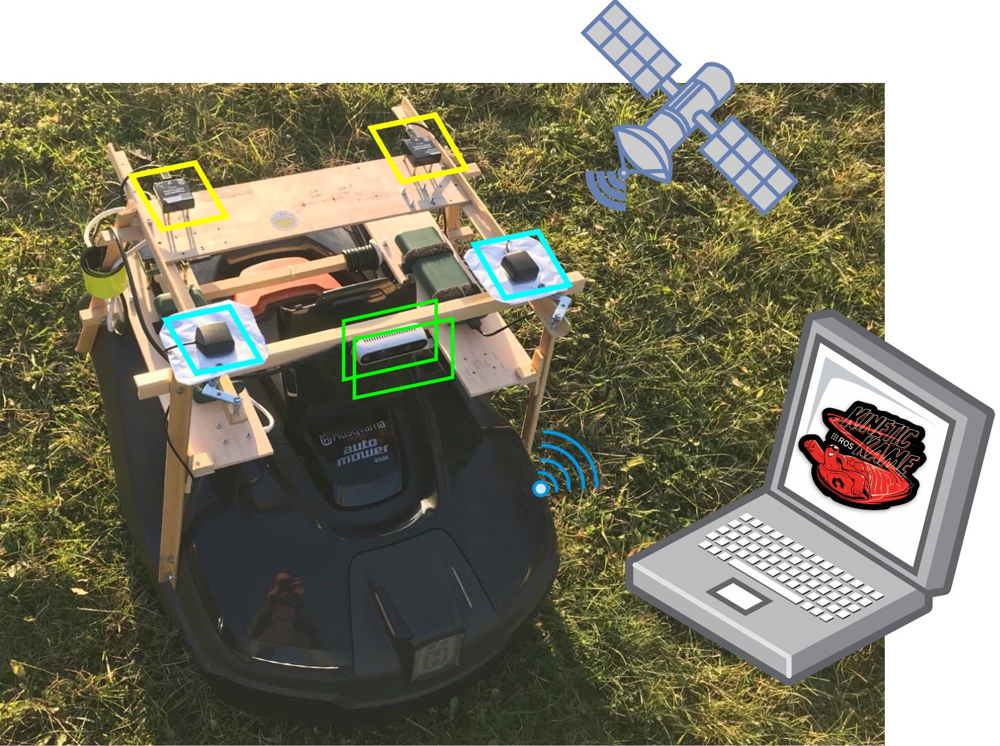

# Sensor fusion of heterogeneous devices for precise outdoor localisation of a mobile robot 
## Implementation and analysis of techniques to localise precisely an automower in an outdoor lawn
======


## Contents

- [Overview](#Overview)
- [Launch](#Launch)
- [Documentation](#Documentation)
- [License](#License)
<!-- - [API documentation](#API-documentation) -->
<!-- - [Read more](##Read-more) -->


## Overview
<a name="Overview"></a>

This project is designed for Huqvarna automower 450x as a trial to replace the underlaid wire boundary. The repository is based on .
It has been added a localization module with additional two IMU, two GNSS, and one Intel Realsense D435 depth camera. 

The localization function is considered an active approach that applies Kalman filters to fuse the sensors' outputs and can integrate with the estimated pose from the visual odometry node. 

The software is designed under Ubuntu 20.04 and ROS Noetic. 


## Launch
<a name="Launch"></a>

In order to test, we seperate the functions into different launch files, which can be combined in one overall launch if desired.

### On physical hardware

Launch files   | Functions
-------------- | -------
`roslaunch am_driver_safe automower_hrp.launch`	| Launch the robot
`roslaunch am_sensors sensors.launch`          	| Launch the added sensors
`rosrun am_driver hrp_teleop.py`            	| Control via keyboard
`roslaunch am_driver_safe ekf_template.launch`  | Launch localization
`./am_vision/scripts/boundary_detect.py`        | Run the boundary detect node (may link to ROS later)
`roslaunch am_sensors rtabmap.launch`           | Launch visual-SLAM
`roslaunch am_driver path_follow`				| Run the path follower


### In simulation
Althought not heavily used in this projected, the simulation in Gazebo provides models of the robot and sensors. Two lawn settings are also available in `simulation/am_gazebo/worlds`. In order to launch: 
```
roslaunch am_gazebo am_gazebo_hrp.launch gui:=true
```
The robot in simulation also receives control input via the topic `/cmd/vel`, so `hrp_teleop.py` can be useful here.


## License
<a name="License"></a>

This repository is under the open source MIT License. 
